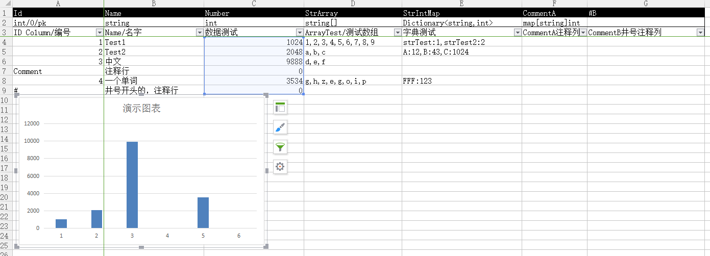

配置表模块/SettingModule
=========================

简介
---------

策划把配置表都是Excel表组成的，游戏里的关卡列表、怪物列表、技能列表、AI参数、游戏数值等都由配置表控制。可以说策划配置表的存在构成了整个游戏。

它的好处是，把一些常用的配置脱离程序代码，供策划进行配置、修改游戏，不用编译进去游戏程序，更加灵活。

原理
-------------



* 以Excel为配置表编辑工具, 可为Excel添加表头注释、表格图标
* Excel将被编译成纯文本的Tab表格和C#代码
* 运行端的Tab表格读取，为了性能避开使用Attribute、反射，同时避免过量的代码生成，不使用泛型


编译器
------------------------------
首先理解，Excel表编译本质上是将Excel表转成制表符（Tab）分隔的文本文件。

菜单KEngine->Compile Settings，按一下策划表编译就可以了。

### 策划表自动编译规则

- 第一行是英文表头
- 第二行是注释表头, 可以是中文
- 第三行是列类型定义/默认值/是否主键，如 string,defaultStr,pk
- 建议将第一列设成“Id”并且类型定义为int,0,pk
- 英文表头如果带有"Comment"，如Comment1,Comment2, 不会自动编译
- 只有Sheet1会被处理， sheet 2 和sheet 3可以乱涂乱画。Sheet可以改名。
- 文本框、批注、图表。。。只要不是单元格内容，都可以随意添加

### 代码生成

配置表模块将根据Excel的表头设置的字段类型，自动生成代码：

```csharp
    public partial class ExampleInfos
    {
		public static readonly string TabFilePath = "Example.bytes";

        public static TableFile GetTableFile()
        {
            return SettingModule.Get(TabFilePath);
        }

        public static IEnumerable GetAll()
        {
            var tableFile = SettingModule.Get(TabFilePath);
            foreach (var row in tableFile)
            {
                yield return ExampleInfo.Wrap(row);
            }
        }

        public static ExampleInfo GetByPrimaryKey(object primaryKey)
        {
            var tableFile = SettingModule.Get(TabFilePath);
            var row = tableFile.GetByPrimaryKey(primaryKey);
            if (row == null) return null;
            return ExampleInfo.Wrap(row);
        }
    }
```
> 参照KEngine.UnityProject/Assets/AppSettings.cs

在实际的使用中，直接调用生成的配置表相关代码即可：
```csharp
        foreach (ExampleInfo exampleInfo in ExampleInfos.GetAll())
        {
            Debug.Log(string.Format("Name: {0}", exampleInfo.Name));
            Debug.Log(string.Format("Number: {0}", exampleInfo.Number));
        }
        var info = ExampleInfos.GetByPrimaryKey("A_1024");
        Debuger.Assert(info.Name == "Test1");
```

### 惰式初始化

参看SettingModule.cs类，其对需要加载的配置表进行了惰式加载处理： 即第一次使用时进行初始化。
从而避免游戏启动时的集中式初始化，降低启动时间，优化执行性能。


